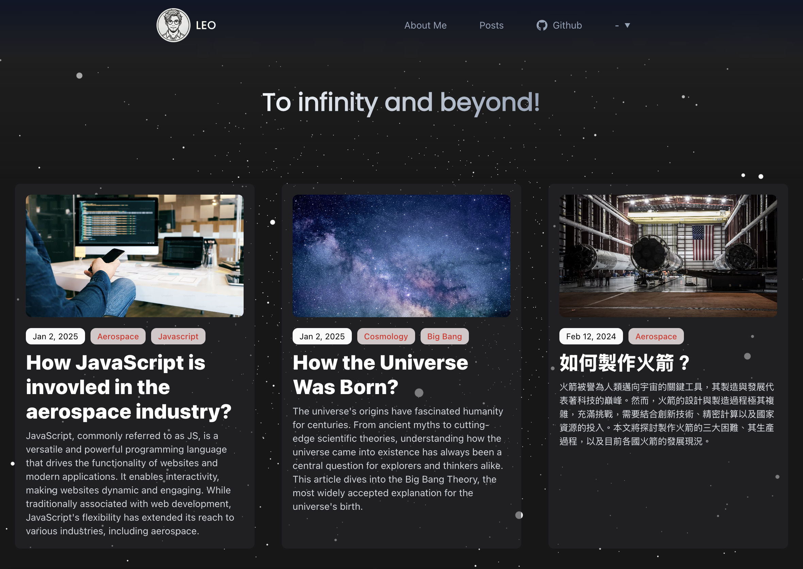

# Leo - Astro Theme With Tailwindcss & MDX


Leo is an Astro theme built with [Tailwind](https://tailwindcss.com/), [React.js](https://react.dev/) and [Three.js](https://threejs.org/) that gives you a sense of exploration in the universe and is designed to make writing posts easy. Besides the features offered by other blog themes, the Leo theme comes with an i18n setting for multi-language writers.

For the starry sky background animation on the page, I implemented the continuous movement effect using Three.js. Initially, you will see the constantly moving animation. However, to prevent this animation from affecting the user's reading experience, the movement speed slows down almost to a stop whenever there is any mouse interaction. It will only return to the fast movement once the user stops interacting for a while.

This background component is created using React and Canvas. Since animations are typically resource-intensive, I added the [client:idle Client Directive](https://docs.astro.build/en/reference/directives-reference/#clientidle) to this component to ensure it doesn't impact the page's loading speed.



## Install 
You can quickly create an Astro blog project and use this theme as a template with the following command in just a few seconds.
```
pnpm create astro@latest moojing/astro-leo-theme
```

## Commands

All commands are run from the root of the project, from a terminal:

| Command                   | Action                                           |
| :------------------------ | :----------------------------------------------- |
| `pnpm install`             | Installs dependencies                            |
| `pnpm run dev`             | Starts local dev server at `localhost:4321`      |
| `pnpm run build`           | Build your production site to `./dist/`          |
| `pnpm run preview`         | Preview your build locally, before deploying     |
| `pnpm run astro ...`       | Run CLI commands like `astro add`, `astro check` |
| `pnpm run astro -- --help` | Get help using the Astro CLI                     |

## i18n Content Support

You can have your content in different langugages after setting the `LANGUAGES` in the `src/config.ts` file. Then add the folder with corresponding language code in your entry folder. For example, in the project, the folder structure inside `src/content/blog` is like this:

```
...
├── blog
│   ├── en
│   │   ├── some-en-post.mdx
│   │   ├── s ome-en-post-1.mdx
│   │   └── ...
│   └── zh
│       ├── some-zh-post.mdx
│       ├── some-zh-post-1.mdx
│       └── ...
...
```

One thing to note is that on the homepage, all posts will be listed without distinguishing between languages. However, the "Posts" link in the header will direct to the English version by default. You can modify this behavior according to your needs.

For other issue you're facing about i18n support from Astro, read the [Astro Docs](https://docs.astro.build/en/recipes/i18n/) for more information.


### Using Rough Notation
Leo is an Astro theme inspired by another Astro theme [Mia](https://github.com/infinity-ooo/astro-theme-mia). So is also based on the [Rough Notation](https://roughnotation.com/) library. You can use `<Notation />` component in your MDX content, such as:

```mdx
In JavaScript, the Array object can be seen as a combination of both <Notation type="box" color="blue">list storage</Notation> and <Notation type="box" color="blue">utility methods</Notation>, providing a unified structure for storing and manipulating data.
```

And following is the type of this component:

```tsx
type Props = {
  type?: "underline" | "circle" | "crossed-off" | "highlight" | "strike-through" | "bracket";
  color?: string;
  strokeWidth?: number;
};
```

### Theme Configuration

Update the `src/config.ts` file to configure the theme:

- `SITE_FAVICON`: the favicon of the site
- `SITE_LOGO`: the logo of the site
- `SITE_TITLE`: the title of the site
- `SITE_DESCRIPTION`: the description of the site
- `ME_AVATAR`: the avatar of the site
- `LANGUAGES`: the i18n languages of the site
- `MENUS`: the menus of the site
- `FOOTER_CONTENT`: the content of the footer
- `CONTACTS`: the contacts about the site
- `GOOGLE_GTAG`: the Google Tag Manager ID

### Theme Integrations

- @astrojs/mdx: <https://docs.astro.build/en/guides/markdown-content/>
- @astrojs/rss: <https://docs.astro.build/en/guides/rss/>
- @astrojs/sitemap: <https://docs.astro.build/en/guides/integrations-guide/sitemap/>
- @astrojs/tailwind: <https://docs.astro.build/en/guides/integrations-guide/tailwind/>
- rough-notation: <https://roughnotation.com/>

### License

- [MIT](LICENSE)
